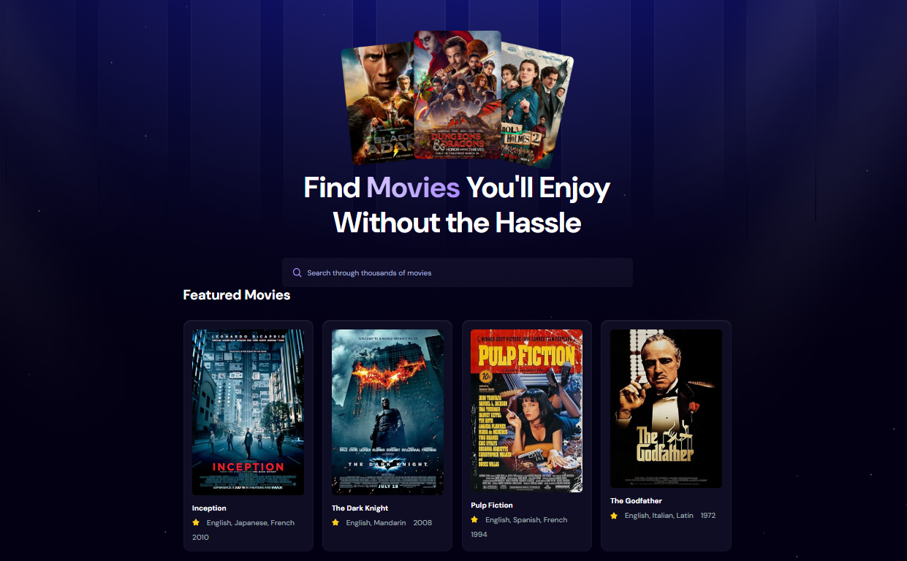

# Movie Watchlist

A modern, feature-rich movie watchlist application built with React and powered by the OMDb API. Search for movies, manage your watchlist, and track what you've watched — all in a sleek dark-themed UI.



## Features

- **Movie Search** — Search through thousands of movies using the OMDb API with debounced input for a smooth experience.
- **Featured Movies** — Curated default movies displayed on the home page when no search is active.
- **Watchlist Management** — Add movies to your personal watchlist with a single click.
- **Watched Tracker** — Mark movies as watched and keep track of everything you've seen.
- **Movie Details Modal** — View detailed information including plot, cast, director, ratings, and more.
- **Filter & Sort** — Filter your watchlist/watched list by title and sort by name or year.
- **Persistent Storage** — Your data is saved to `localStorage`, so it persists across browser sessions.
- **Responsive Design** — Fully responsive layout that works seamlessly on desktop, tablet, and mobile.

## Tech Stack

| Technology | Purpose |
|---|---|
| **React 19** | UI library for building component-based interfaces |
| **React Router v7** | Client-side routing and navigation |
| **Vite** | Fast build tool and dev server |
| **Tailwind CSS v4** | Utility-first CSS framework for the home page |
| **OMDb API** | Movie data source (posters, ratings, details) |
| **Context API + useReducer** | Global state management for watchlist and watched lists |
| **localStorage** | Client-side data persistence |

## Project Structure

```
Movie-Watchlist/
├── public/                  # Static assets (images, icons)
│   ├── hero.png             # Hero section image
│   ├── hero-bg.png          # Hero background pattern
│   ├── no-movie.png         # Fallback poster image
│   └── _redirects           # Netlify SPA redirect rules
├── src/
│   ├── components/
│   │   ├── Header.jsx       # Navigation bar
│   │   ├── Home.jsx         # Landing page with hero section
│   │   ├── MovieSearch.jsx  # Search input + results grid
│   │   ├── ResultCard.jsx   # Individual search result card
│   │   ├── MovieCard.jsx    # Card used in watchlist/watched pages
│   │   ├── MovieControls.jsx# Action buttons (move, remove)
│   │   ├── MovieDetailModal.jsx # Full movie details popup
│   │   ├── Watchlist.jsx    # Watchlist page with filter/sort
│   │   └── Watched.jsx      # Watched page with filter/sort
│   ├── context/
│   │   ├── GlobalState.jsx  # Context provider with actions
│   │   └── AppReducer.jsx   # Reducer for state management
│   ├── lib/                 # Font Awesome (self-hosted)
│   ├── App.jsx              # Root component with routing
│   ├── App.css              # Global styles and component CSS
│   └── main.jsx            # App entry point
├── index.html               # HTML entry point
├── vite.config.js           # Vite configuration
└── package.json             # Dependencies and scripts
```

## Getting Started

### Prerequisites

- [Node.js](https://nodejs.org/) (v18 or higher recommended)
- An OMDb API key — get one free at [omdbapi.com](https://www.omdbapi.com/apikey.aspx)

### Installation

1. **Clone the repository**
   ```bash
   git clone https://github.com/Harvey-08/Movie-watchlist.git
   cd Movie-watchlist
   ```

2. **Install dependencies**
   ```bash
   npm install
   ```

3. **Set up environment variables**

   Create a `.env` file in the root directory:
   ```
   VITE_OMDB_KEY=your_omdb_api_key
   ```

4. **Start the development server**
   ```bash
   npm run dev
   ```

5. Open `http://localhost:5173` in your browser.


